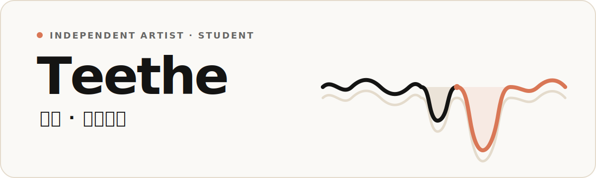

  <a href="./README.md">简体中文</a>&nbsp;&nbsp;·&nbsp;&nbsp;English

  <picture>
    <source media="(prefers-color-scheme: dark) and (max-width: 600px)" srcset="./assets/teethe-hero-mobile-dark.svg">
    <source media="(max-width: 600px)" srcset="./assets/teethe-hero-mobile-light.svg">
    <source media="(prefers-color-scheme: dark)" srcset="./assets/teethe-hero-dark.svg">
    
  </picture>
   
  <picture>
    <source media="(prefers-color-scheme: dark)" srcset="./assets/typing-dark.svg">
    
  </picture>

# Hi, I’m Teethe (无牙)

**A student still growing, and an independent artist.**

My work leans toward front-end experiences, UI/UX, and graphic design. I start with visuals and experience, then use vibe coding—with Swift, Python, JavaScript, and React—to turn ideas into things that genuinely work.

## About the name

I once went by `52hertz`—a lone frequency moving through the deep. Today, I go by `Teethe`.

`Teethe` means to cut one’s first teeth; to me, it also evokes fangs still taking shape—a posture for facing difficulty and a reminder to keep growing without fear.

## Design & tools

> Visuals and experience set the direction. Code makes it real.

**Design**

 

**Build**

   

**Approach**

 

## Selected work

- **[claude-quota](https://github.com/is52hertz/claude-quota)** — A local macOS CLI for checking Claude Code account quota and rate-limit windows, without logging prompts or responses. Rust · macOS · CLI

- **[Exporter](https://github.com/is52hertz/Exporter)** — A read-only iOS app that exports authorized Apple HealthKit health and fitness data into versioned, LLM-friendly JSON. Swift · SwiftUI · HealthKit

- **[BlackoutSignal](https://github.com/is52hertz/BlackoutSignal)** — A menu-bar utility for Apple Silicon Macs that blacks out displays while keeping the video signal alive, preventing external monitors from showing “No Input.” Swift · macOS · DDC/CI

- **[Relay](https://github.com/is52hertz/Relay)** — A native macOS global app switcher that organizes hotkeys into workflow-based Profiles and launches, focuses, hides, or returns you to the previous app based on the target app’s current state. Swift · SwiftUI · AppKit

## Beyond the screen

I keep studying graphic design and enjoy drawing, music, and photography. They continue to shape the way I understand color, rhythm, composition, and emotion.

## A trail of growth

  <picture>
    <source media="(prefers-color-scheme: dark)" srcset="https://raw.githubusercontent.com/is52hertz/is52hertz/output/github-contribution-grid-snake-dark.svg">
    
  </picture>

## Say hello

If you’re also bringing design, technology, and personal expression together, feel free to say hello.

   

Still learning. Still making. Still growing teeth.

