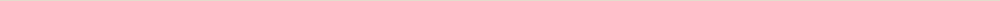

  简体中文&nbsp;&nbsp;·&nbsp;&nbsp;<a href="./README-EN.md">English</a>

  <picture>
    <source media="(prefers-color-scheme: dark) and (max-width: 600px)" srcset="./assets/teethe-hero-mobile-dark.svg">
    <source media="(max-width: 600px)" srcset="./assets/teethe-hero-mobile-light.svg">
    <source media="(prefers-color-scheme: dark)" srcset="./assets/teethe-hero-dark.svg">
    
  </picture>
   
  <picture>
    <source media="(prefers-color-scheme: dark)" srcset="./assets/typing-dark.svg">
    
  </picture>

# 哈喽，这里是 Teethe（无牙）

**学生/独立艺术创作者。**

我的创作更偏向前端体验、UI/UX 与平面设计。我从视觉和体验出发，再借助 Vibe Coding，以及 Swift、Python、JavaScript / React，把想法做成真实可用的东西。
同时，我也热爱摄影、绘画和音乐，并将其理念融入我的作品。

<h2>创作工具</h2>

*Make it ReaL.*

**设计 / Design**

 

**构建 / Build**

   

**方式 / Approach**

 

<h2>项目</h2>

  <strong><a href="https://github.com/is52hertz/claude-quota">claude-quota</a></strong> 
  一个在 macOS 本地查看 Claude Code 账户额度与限额窗口的 CLI，不记录 prompt 或 response。 
  Rust · macOS · CLI

  <strong><a href="https://github.com/is52hertz/Exporter">Exporter</a></strong> 
  一款只读 iOS App，将用户授权的 Apple HealthKit 健康与运动数据导出为版本化、对 LLM 友好的 JSON。 
  Swift · SwiftUI · HealthKit

  <strong><a href="https://github.com/is52hertz/BlackoutSignal">BlackoutSignal</a></strong> 
  一款面向 Apple Silicon Mac 的菜单栏工具：让屏幕变黑但保持视频信号，避免外接显示器出现“无输入”画面。 
  Swift · macOS · DDC/CI

  <strong><a href="https://github.com/is52hertz/Relay">Relay</a></strong> 
  一款原生 macOS 全局应用切换器，用基于工作场景的 Profiles 管理多组快捷键，并根据目标应用的当前状态执行启动、聚焦、隐藏或返回上一应用。 
  Swift · SwiftUI · AppKit

## 轨迹

  <picture>
    <source media="(prefers-color-scheme: dark)" srcset="https://raw.githubusercontent.com/is52hertz/is52hertz/output/github-contribution-grid-snake-dark.svg">
    
  </picture>

## 找到我

如果你也在把设计、技术与个人表达放在一起，也想 Make the world，欢迎来聊。

   

Still learning. Still making. Still growing teeth.

